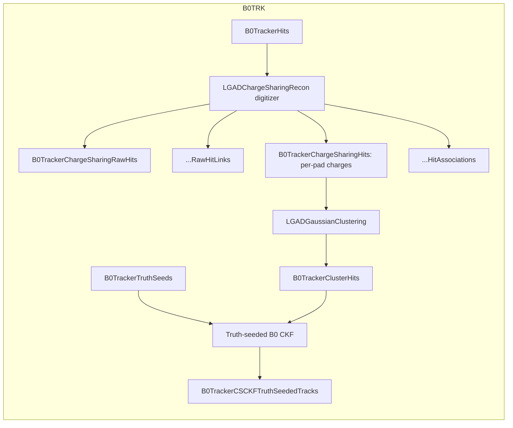

# AC-LGAD Charge Sharing EICrecon Plugin

Out-of-tree `EICrecon_MY` plugin that provides AC-LGAD charge-sharing reconstruction for the B0 tracker. It digitizes `edm4hep::SimTrackerHit` collections into per-pad LogA charges, then clusters those pads and estimates one sub-pixel position per cluster.

This is a self-contained extraction of the plugin suite from
[tom-bleher/epicChargeSharing](https://github.com/tom-bleher/epicChargeSharing)
(its `eicrecon/` + `core/` directories), building against a stock EICrecon
install exactly like the sibling `AnalysisFF/B0Trackers` plugin. The physics
library is vendored under `core/`; the standalone Geant4 validation harness
stays in the parent repository.

This plugin is structured to follow the upstream `eic/EICrecon` conventions (`algorithms::Algorithm`, `JOmniFactory`, `plugin_*` CMake helpers, per-detector plugin libraries). The novel physics lives in the compiled static library under `core/` and is shared with the standalone Geant4 validation harness.

> **Status: prototype.** The implementation follows the upstream-style staged
> pipeline: per-pad digitization first, position estimation during clustering.
> Tracking validation is truth-seeded and uses only stock EICrecon factories;
> data-like B0 seeding is intentionally out of scope for this plugin.

## Naming

| Legacy symbol | New name |
|---------------|----------|
| `ChargeSharingReconstructor` | `LGADChargeSharingRecon` |
| `ChargeSharingReconFactory` | `LGADChargeSharingRecon_factory` |
| `ChargeSharingConfig` | `LGADChargeSharingReconConfig` |
| `ChargeSharingClustering` | `LGADGaussianClustering` |
| `ChargeSharingClustering_factory` | `LGADGaussianClustering_factory` |
| `ChargeSharingClusteringConfig` | `LGADGaussianClusteringConfig` |
| `ChargeSharingMonitor` | `LGADChargeSharingMonitor` |

- Plugin-visible symbols: `eicrecon::` namespace.
- Novel physics: `chargesharing::{core,fit}::` namespaces inside `core/include/chargesharing/{core,fit}/*.hh` (compiled static library `chargesharing::core`; shared with standalone harness).
- All plugin-side headers use `.h`; the compiled `chargesharing_core` library keeps `.hh` for its public headers.

## Per-detector plugins and collections

| Plugin library | Input collection | Output collections |
|----------------|------------------|--------------------|
| `B0TRK_lgad_chargesharing.so` | `B0TrackerHits`, `B0TrackerTruthSeeds` | `B0TrackerChargeSharingRawHits`, `B0TrackerChargeSharingHits`, `B0TrackerChargeSharingRawHitLinks` (EDM4eic >= 8.7), `B0TrackerChargeSharingHitAssociations`, `B0TrackerClusterHits`, `B0TrackerCSCKFTruthSeededTracks`, `B0TrackerCSCKFTruthSeededTrackRootAssociations` |
| `LGAD_chargesharing_benchmark.so` | (reads the above) | residual TTree in `-Phistsfile=...` |

## Build

```bash
EIC_SHELL=${EIC_SHELL:-/home/tomble/eic/eic-shell}
"$EIC_SHELL"
cmake -S . -B build -DCMAKE_INSTALL_PREFIX=$PWD/install
cmake --build build --target install
```

`/home/tomble/eic/eic-shell` is the local installation used in this checkout.
On another host, substitute the path to that host's `eic-shell` executable.

Plugins are installed to `install/plugins/`. Following the standard
`EICrecon_MY` convention ([EICrecon plugin tutorial](https://eic.github.io/tutorial-reconstruction-algorithms/)),
set `export EICrecon_MY="$PWD/install"` from this directory. The sibling
`AnalysisCS/EICrecon_MY` symlink points to the same install tree.

## Run

```bash
export EICrecon_MY="${LGAD_PLUGIN_DIR:-$(pwd)/install}"
OUTPUT_COLLECTIONS=EventHeader,MCParticles,B0TrackerHits,B0TrackerChargeSharingRawHits,B0TrackerChargeSharingHits,B0TrackerChargeSharingHitAssociations,B0TrackerClusterHits,B0TrackerCSCKFTruthSeededTrajectories,B0TrackerCSCKFTruthSeededTrackParameters,B0TrackerCSCKFTruthSeededTracks,B0TrackerCSCKFTruthSeededTrackAssociations,B0TrackerCSCKFTruthSeededTrackRootAssociations
# Available with EDM4eic >= 8.7; omit this line for older installations.
OUTPUT_COLLECTIONS="$OUTPUT_COLLECTIONS,B0TrackerChargeSharingRawHitLinks,B0TrackerCSCKFTruthSeededTrackLinks"
eicrecon \
    -Pplugins=B0TRK_lgad_chargesharing,LGAD_chargesharing_benchmark \
    -Phistsfile=lgad_hists.root \
    -Ppodio:output_file=reco_output.edm4eic.root \
    -Ppodio:output_collections="$OUTPUT_COLLECTIONS" \
    sim_output.edm4hep.root
```

## Testing

Everything runs inside `eic-shell` with an ePIC install sourced.
`thisepic.sh` sets `DETECTOR_PATH`, which the bundled `test_b0.xml` compact
needs. The event generator also requires `pyhepmc`.

```bash
export EPIC_INSTALL=/path/to/epic_b0pads500/install
source "$EPIC_INSTALL/bin/thisepic.sh"
# Only needed when pyhepmc is not already installed in the environment:
export PYTHONPATH="/path/to/pyhepmc${PYTHONPATH:+:$PYTHONPATH}"

# Unit tests + B0 truth-seeded benchmark (gen -> ddsim -> eicrecon -> validate).
# Set to 0 when building against EDM4eic < 8.7.
export LGAD_ENABLE_MODERN_LINKS=1
bash test/run_all_tests.sh --nevents 50
```

## Core configuration

The user-facing config contains only digitization parameters. Pixel pitch and
grid coordinates come from the `CartesianGridXY` / `CartesianGridXZ`
segmentation. Electrode metal size is a separate physical quantity and comes
from an explicit compact-geometry constant (`B0TrackerElectrodeSize` for B0);
it is never inferred from the segmentation pitch.

### `LGADChargeSharingRecon`

| Parameter | Type | Default | Description |
|-----------|------|---------|-------------|
| `readout` | string | - | DD4hep readout name |
| `minEDepGeV` | float | 0 | Energy threshold |
| `neighborhoodRadius` | int | 2 | Half-width (2 = 5x5 grid) |
| `d0Micron` | double | 1.0 | LogA d0 |
| `ionizationEnergyEV` | double | 3.6 | e/h pair energy |
| `amplificationFactor` | double | 20 | AC-LGAD gain |
| `noiseEnabled` | bool | true | Noise injection |
| `noiseElectronCount` | double | 500 | Electronic noise RMS |
| `thresholdElectrons` | double | 0 | Per-pad threshold after summed charge and noise |

### `LGADGaussianClustering`

| Parameter | Type | Default | Description |
|-----------|------|---------|-------------|
| `readout` | string | - | DD4hep readout name |
| `timeResolutionNs` | double | 0.289 ns | Passive `Measurement2D` time uncertainty |
| `fitErrorPercent` | double | 5.0 | Fit uncertainty as % of max charge |

## Pipeline



## Algorithm

For each `SimTrackerHit`, `LGADChargeSharingRecon`:

1. Transforms the global simulation hit into its sensor-local frame and decodes the cell ID to locate the center pad.
2. Computes LogA per-pad charge fractions across a `(2*neighborhoodRadius+1)^2` neighborhood. See [Tornago et al.](https://doi.org/10.1016/j.nima.2021.165319).
3. Optionally applies per-pixel gain variation and electronic noise.
4. Emits pad-centered digitized hits carrying the shared charge and associations back to the truth hit.

All deposits in one event that induce charge on the same pad are summed before
electronics; their earliest time is retained only as output metadata. `LGADGaussianClustering`
runs union-find over DD4hep neighbours and emits one `Measurement2D` per cluster.
Neither stage uses time to form channels or clusters.

## Benchmark output

Loading `LGAD_chargesharing_benchmark` writes one compact TTree at
`LGADChargeSharing/hits` in the shared `-Phistsfile=...` file. It contains
`residualX`, `residualY`, `dominantAncestorPurity`, `dominantAncestorIndex`, and
`isMixed`. Residuals use the dominant generated ancestor's charge-weighted truth
position, so deposits from its Geant4 daughters remain part of its response while
deposits from another generated particle are explicitly reported as mixed.

## Relationship to the standalone Geant4 harness

The parent repository ([tom-bleher/epicChargeSharing](https://github.com/tom-bleher/epicChargeSharing), checked out at `/home/tomble/eic/epicChargeSharing`) additionally ships a standalone Geant4 **validation harness**, not an ePIC simulator. ePIC production simulation uses `npsim`/`ddsim`. The standalone harness runs the exact same `core/` physics on parametric pad grids so that plugin behaviour can be cross-checked against a simplified environment. Keep this vendored `core/` in sync with the parent repository's `core/` when the physics changes.
